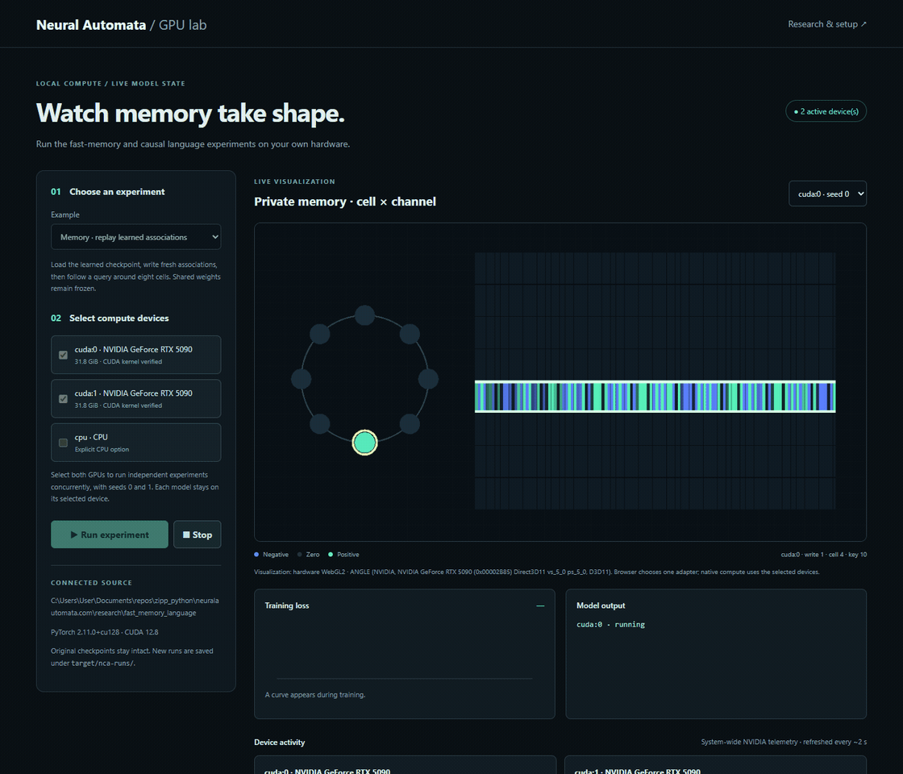
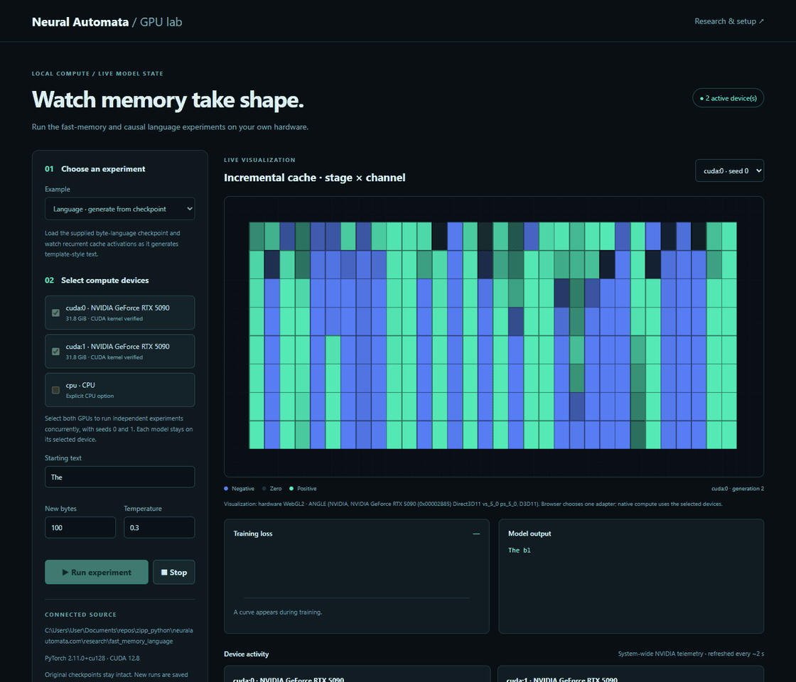

# Neural Automata: memory and language experiments

A local research lab for cellular memory and a causal byte language model, with
native PyTorch/CUDA execution and a WebGL2 view of real model state.
These are two separate models, not a combined online-learning chatbot.

## Start the GPU lab

Use Node 22+ and Python with PyTorch installed for your CPU or CUDA hardware.
The models, baseline checkpoints, experiment logs and toy training text are included.
No Zipp checkout or WASM build is required.

```powershell
$env:NCA_PYTHON = 'C:\Python311\python.exe'
node server/serve.cjs
```

On macOS/Linux: `NCA_PYTHON=python3 node server/serve.cjs`.
Open the printed localhost URL. Choose an experiment and device, then Run.
CPU is an explicit option. Selecting multiple GPUs launches independent runs
with different seeds; it does not combine their VRAM or split one model across GPUs.
The browser selects one adapter for WebGL2 drawing.

| Experiment | What happens |
|---|---|
| Memory replay | Load the baseline checkpoint, freeze shared weights, write fresh associations and follow a query around the ring. |
| Memory training | Train new memory-model weights and show loss and private-state snapshots. |
| Language generation | Generate bytes from the supplied template-text checkpoint and show recurrent cache state. |
| Language training | Train a new causal byte model from the bundled toy text. |

New checkpoints and logs go to ignored `target/nca-runs/`; supplied baselines remain unchanged.
The server binds to loopback and offers fixed experiments. It does not execute uploaded browser scripts.
Full native PyTorch runs locally; the browser renders snapshots. This is not Python running in WASM.

## Watch actual runs




Recordings loop automatically. [Memory still](web/recordings/nca-memory.png) ·
[Language still](web/recordings/nca-language.png) · [Capture provenance](web/recordings/provenance.json). These are demonstrations, not benchmarks.
Regenerate with `python scripts/capture-demos.py` (Chrome, Python Playwright, ffmpeg and CUDA required).

## Repository layout

- `research/fast_memory_language/`: models, training/replay commands, tests, baseline checkpoints and original experiment results.
- `server/`: fixed native workload runner and loopback API.
- `web/`: live heatmap/ring visualization and recordings.
- `tests/`: bridge contracts and real-browser/CUDA acceptance.
- `scripts/`: reproducible capture tooling.
- `docs/`: migration record and import hashes.

Start with the [research guide](research/fast_memory_language/RESEARCH.md),
[recorded results](research/fast_memory_language/RESULTS.md) and
[experiment commands](research/fast_memory_language/README.md).
Those files describe the original CPU baseline; later GPU checks are separate functional evidence.
The language checkpoint has a 17-byte context and was trained on original template text.
It is not a general-purpose language model. Small workloads need not saturate a GPU.

## Check and reproduce

```sh
node --test tests/*.test.cjs
python -m pip install pytest
python -m pytest research/fast_memory_language/tests -q
python tests/smoke.py
```

The last command requires Chrome, Python Playwright and working CUDA, tests all four
modes on all available CUDA devices, explicit CPU, stop/reload and lost WebGL context.
It fails when CUDA is missing rather than claiming GPU acceptance.

This project was separated from [Zipp](https://github.com/f2i-com/zipp.org).
Zipp retains the Python/JavaScript VM and generic browser GPU/Game of Life examples.
See [migration and provenance](docs/MIGRATION.md) for source and license scope.
